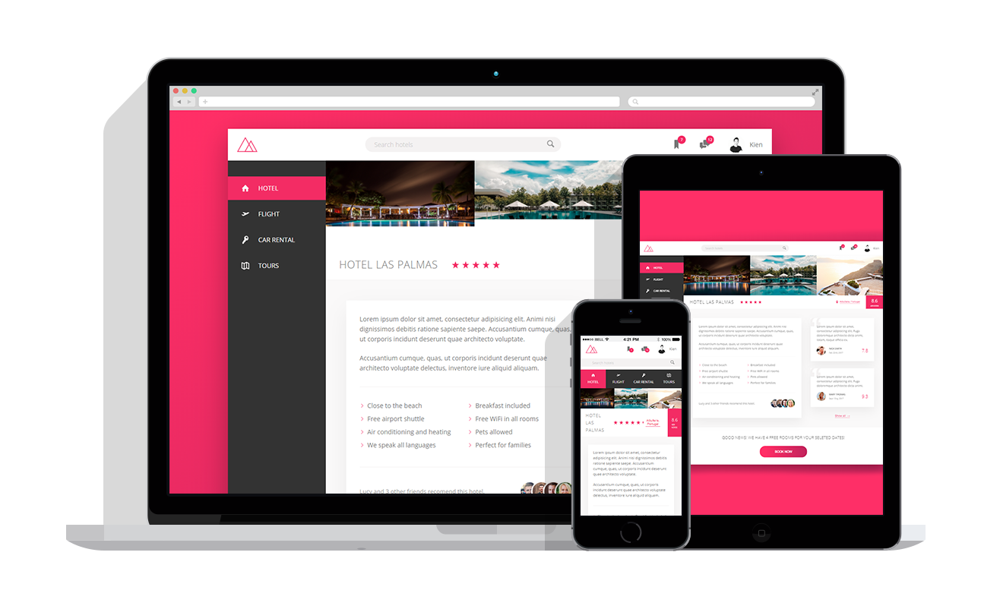

## Trillo App

A web application mockup made only use flexbox

  <a href="https://kien-trillo-app.netlify.com/">Live Demo</a>

  

## 👨‍🎓What I learned:

- How to use effectively use flexbox to create a responsive layout

## Personal Application:

- I started using flexbox to tweak my blog and my personal portfolio
- Understanding flexbox has deepen my CSS knowledge and I'm able to move certain elements on my website without having to use floats.
